<!-- DYNAMIC HEADER SVG (auto-updated every hour with greeting) -->
<div align="center">
  
</div>

<!-- TYPING SVG -->
<div align="center">
  
</div>

<br>

<div align="center">
  
  &nbsp;
  
  &nbsp;
  <a href="https://gh-most-followed.pages.dev/egypt">
    
  </a>
  &nbsp;
  <a href="https://committers.top/egypt">
    
  </a>
</div>

---

## `$ whoami`

```terminal
Name     : Abdulrahman Fikry
Role     : .NET Developer | DevOps Engineer
Location : Egypt 🇪🇬
Status   : Open to Work 
Focus    : Clean Architecture · SOLID Principles · Cloud-Native Systems
```

---

## `$ cat stats`

<div align="center">

<!-- GITHUB METRICS (auto-updated every 3 hours) -->


<br>


<br>


<br>


</div>

---

## `$ ls tech-stack`

<div align="center">

**⚙️ Backend & Languages**


<br><br>

**🗄️ Databases & Caching**


<br><br>

**☁️ DevOps, Cloud & Infrastructure**


<br><br>

**🔧 Tools & Platforms**


<br><br>


</div>

---

---

## `$ ls projects/`

<div align="center">

<a href="https://github.com/abdulrahman11a/MyZoo">
  
</a>
<a href="https://github.com/abdulrahman11a/Talabat_Web_Api">
  
</a>
<a href="https://github.com/abdulrahman11a/CRUD_Operations_Project">
  
</a>

</div>

---

## `$ ./problem-solving`

<div align="center">

<a href="https://leetcode.com/u/abdulrahmanfikry1/">
  
</a>

<br><br>

<a href="https://codeforces.com/profile/ABDULRAHMANFIKRY0">
  
</a>

</div>

---

## `$ cat trophies.txt`

<div align="center">
  
</div>

---

## `$ ./3d-contrib --view`

<!-- 3D CONTRIBUTION CALENDAR (auto-updated every 12 hours) -->
<div align="center">
  
</div>

---

<!-- SNAKE ANIMATIONS (auto-updated every 6 hours) -->
<div align="center">

**🟢 Dark Theme**

<picture>
  <source media="(prefers-color-scheme: dark)"  srcset="./dist/snake-dark.svg"/>
  <source media="(prefers-color-scheme: light)" srcset="./dist/snake-dark.svg"/>
  
</picture>

<br>

---

## `$ ./connect --all`

<div align="center">

<a href="mailto:abdulrahmanfikry1@gmail.com">
  
</a>
<a href="https://www.linkedin.com/in/abdulrahman-fikry-7787392a6/">
  
</a>
<a href="https://github.com/abdulrahman11a">
  
</a>
<a href="https://codeforces.com/profile/ABDULRAHMANFIKRY0">
  
</a>
<a href="https://leetcode.com/u/abdulrahmanfikry1/">
  
</a>

<br><br>

<a href="https://drive.google.com/drive/folders/1nG5q3Yl-fvFKML0jFUDFy3qa5CEEFbpV">
  
</a>

<br><br>

<a href="https://skyline.github.com/abdulrahman11a/2025">
  
</a>
<a href="https://skyline.github.com/abdulrahman11a/2024">
  
</a>

<br><br>

*"I'm not a great programmer; I'm just a good programmer with great habits."*
**— Kent Beck**

<!-- FOOTER -->


</div>
